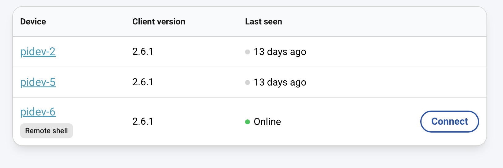
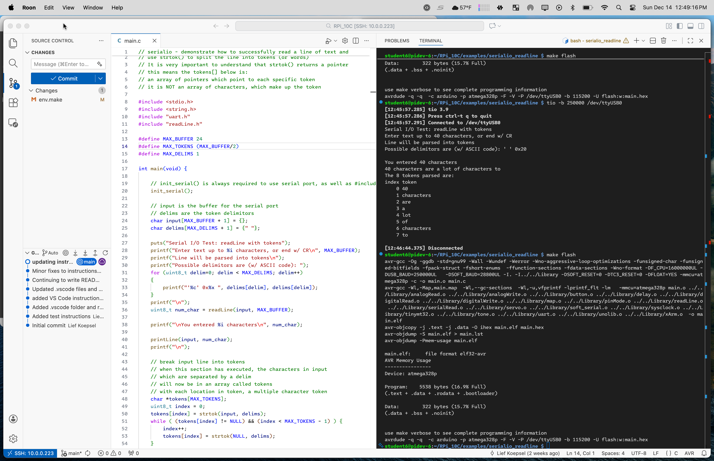

# Raspberry Pi Setup for Uno R3 C Development

## Introduction
This repository is for an introductory course on the *C* language using the *Arduino Uno R3*, the *C* tool chain (*avr-gcc*, *avrdude* etc) and the [*AVR C Library*](https://github.com/lkoepsel/AVR_C). The content is for students who desire understanding *C* using an embedded microcontroller, in this case the *Arduino Uno R3*. This content uses the *avr* tool chain via command line (also called the *terminal*), it doesn't use the *Arduino IDE* nor does it use the *Arduino software framework*.  

The directory, *templates*, contains the programs for labs. Each template folder contains multiple folders, each folder is a specific programming exercise. Within each exercise folder is a file called *main.c* and a file called *Makefile*. The file *main.c* is the template for the exercise and the *Makefile* is the required file using *make* to compile/link/load it to an UNO. Think of the *main.c* file as the Arduino IDE sketch and the *Makefile* as a command-line version of the *Arduino IDE*. The files in *Library* are similar to those found in the *Arduino framework*.

## Dependencies

These instructions assume you already have an *Arduino Uno R3* (or similar microcontroller) or will have one supplied to you.

### Raspberry Pi
The approach this class follows is to use a standardized platform running the *C* tool chain. This removes the pain of having to maintain documentation and support for each of the major computing platforms, *macOS*, *Windows* and *Linux*. Instead, the platform will be an inexpensive **Raspberry Pi (RPi)** running *Raspberry Pi OS* with all of the required programs pre-installed.

### VS Code
In order to use this content you need to have [**VS Code**](https://code.visualstudio.com) installed on **your** computer or a computer you will be using in class. We will use both the *code editor* and command line interface (*CLI*) or *terminal*, connected remotely to the  RPi.

### Raspberry Pi Login
You will also need a Raspberry Pi Connect login. You may obtain one for free [here](https://connect.raspberrypi.com).

## Installation

### 1. Use Pi Imager v2.0+ for creating Raspberry Pi OS Image
1. Open *Pi Imager*
2. Select your device -> Next
3. Select Raspberry Pi OS (other) -> Raspberry Pi OS Lite (64-bit) -> Next
4. Select Your Storage Device -> Next
5. Choose Hostname -> Next
6. Select:
    * Capital city:
    * Time zone:
    * Keyboard layout: us -> Next
7. Enter:
    * Username:
    * Password
    * Confirm password: -> Next
8. Select Secure Network:
    * SSID:
    * Password
    * Confirm password: -> Next
9. Enable SSH (**turn on**) -> Use password... -> Next
10. Enable Raspberry Pi Connect (**turn on**) -> Open Raspberry Pi Connect -> *confirm Authentication token: is filled in* -> Next
11. Write -> **I UNDERSTAND, ERASE AND WRITE** -> Enter System Password to write to storage device
12. Wait for the Write to finish
13. Remove *SD card/USB drive* and place in *Raspberry Pi*
14. Power up and wait for it to show up in the [Raspberry Pi Connect dashboard](https://connect.raspberrypi.com) . (*Normally takes about 90 seconds.*)

Your *connect* page needs to indicate it has found your Raspberry Pi as indicated by a **Connect** button as shown below for *pidev-6*:



### 2. Connect via Raspberry Connect 

[Raspberry Pi Connect](https://connect.raspberrypi.com)

**NOTE:** In the instructions below, **Command/Control** means, in **macOS**, *press the `command` key* and in **Windows**, *press the `Control` key*.

This step will connect you to the Raspberry Pi using the *command line interface* in your browser window.
#### 1. Connect

Click on the connect button as shown above. This will open a small browser window showing the *CLI* for the *RPi*.

#### 2. Copy and Paste:

```bash
sudo apt update && sudo apt upgrade -y &&
sudo apt-get install gcc-avr binutils-avr avr-libc gdb-avr avrdude git tio -y &&
git clone https://github.com/lkoepsel/RPi_10C.git
```

#### 3. Obtain Uno device address

```bash
# Connect an Arduino Uno via USB cable and run:
tio -l
```
Under **Device** will be something like:
*/dev/ttyUSB0* or */dev/ttyACM0*. 

Copy this string, we'll refer to it as **DEVICE**.

``` bash
cd RPi_10C
nano env.make
# use your arrow keys to move down to line 42
# you can use left/right arrow keys to edit the line
# it will look like this: 'SERIAL = /dev/ttyACM0'
# either confirm SERIAL equals DEVICE
# OR
# overwrite it, with DEVICE
# you will end up with one of two variations below
SERIAL = /dev/ttyACM0
SERIAL = /dev/ttyUSB0
```
*Ctrl-S to save, Ctrl-X to exit*

#### 4. Compile and load Uno with blink program

``` bash
cd examples/blink
make flash
```

**Confirm the Uno is blinking at a fast rate.**

#### 5. Change delay and recompile/load program

```bash
nano main.c
# use the down arrow key to move to line 10
    int delay_ms = 200;
# change the 200 to 2000, by adding an extra 0
```
*Ctrl-S to save, Ctrl-X to exit*

```bash
make flash
```

**Confirm the Uno is blinking at a slow rate (every 2 seconds).**

This confirms everything is working properly.

#### 6. Obtain the IP address to connect using VS Code

```bash
hostname -I
```

The first address will be a IP4 address similar to *10.0.0.223*, *192.168.1.5*, or *172.24.21.220*. This number will be referred to as **IP_ADDRESS** below.

### 3. Connect via VS Code Remote

Open *VS Code*

#### 1. Install the required extensions

**Please install these extensions before continuing.**

```bash
ms-vscode-remote.remote-containers
ms-vscode-remote.remote-ssh
ms-vscode-remote.remote-ssh-edit
ms-vscode.cpptools
ms-vscode.cpptools-themes
ms-vscode.remote-explorer
```

#### 2. Open a remote connection

In **VS Code:**

1. `Shift-command/Control-P`
2. Enter "*remo*" and click on **Remote-SSH: Connect to Host**
3. Enter *username@IP_ADDRESS*, where:
    * **username** is the username, you used on creating the Raspberry Pi OS image *from 1.7 above*
    * **IP_ADDRESS** is the IP_ADDRESS of your Raspberry Pi *from 2.5 above*
4. Click `Continue` on *Are you sure you want to continue?*
5. Enter password
6. Click on **Open Folder** -> **RPi_10C** -> **OK** and might need to click **Yes** to "*Trust...authors*"
7. Use the `Explorer` to open *examples/blink/main.c*
8. Change the *2000* on line 10, to *200* and `command/Control-s` to save the file
9. `Shift-command/Control-B` and click on *flash*

**Now the Uno will be blinking at its original fast rate.**

If you were successful in getting the Uno to blink both fast and slow, you are now ready to begin programming!


## Usage

The recommended method to develop code using this repository is to use both *VS Code code editor* and the *VS Code terminal*, side-by-side. This allows you to quickly and easily perform functions in either window.

### Editor Steps

1. Connect the *Uno* to the *Raspberry Pi* via the USB cable.
2. Follow the *steps 1-6* from **Step 3.2 Open a remote connection**. This will open the *VS Code Editor*, running remotely on the *Raspberry Pi*. 

### Terminal Steps

1. To have a terminal open as well, in VS Code -> Terminal -> New Terminal.
1. To make the *Terminal* window fill the right half of your monitor screen, (*if not already*) right-click on the *Terminal tab -> Panel Postion -> Right*.

Your screen now similar to this, with *Editor* on the left and *Terminal* on the right:



## Additional Sources of Information

* [Developing in C on the AVR ATmega328P](https://www.wellys.com/posts/courses_avr_c/) A series of web pages explaining in detail how to use specific aspects of the AVR C software framework.
* [AVR LibC](https://www.nongnu.org/avr-libc/) This library is the basis for the *C*language for the AVR. From GNU "*AVR Libc is a Free Software project whose goal is to provide a high quality C library for use with GCC on Atmel AVR microcontrollers.*" 

## Directories
**Note: *Library* and *examples* will be maintained identical to the [AVR_C versions](https://github.com/lkoepsel/AVR_C)**

* *examples* - contains code demonstrating how to use specific functions in the Library
* *Library* - *AVR C Library*, specific Arduino functions rewritten in *C* such as analogRead(), analogWrite(), digitalRead(), and pinMode()
* *templates* - template directories for each of the lab exercises. This directory must be duplicated to be used and called *dev*. **This directory is tracked by git and could be over-written in the next clone operation.**
* *dev* - the student's version of the templates directory, where the students will make changes to the lab files. **This directory is not tracked by git and won't be overwritten.**

## Solutions to known issues

### 1. Connecting to an open wireless connection on initial boot

### NOTE: 251217
A bug exists in the Pi Imager 2.0.2 software, where the password on an open wireless network is set to "". This is incorrect, it needs to be changed via auth -> key-management "none". See [OPEN NETWORK...](https://github.com/raspberrypi/rpi-imager/issues/1396). Immediate response to the bug was, it had been fixed for the next release (2.0.3). Will confirm. Then delete these solutions.

In the meantime, this is the best approach and has been confirmed to work, multiple times:

#### Prior to initial boot, edit *network-config*

Open *network-config* on the boot partition (*bootfs*) on *Windows/macOS* and change it to the following:

```bash
version: 2
wifis:
  wlan0:
    dhcp4: true
    optional: true
    regulatory-domain: US
    access-points:
      "mpc-wifi":
        auth:
          key-management: none
```

If the solution above doesn't work, either **Option 2** or **Option 3** work, however, they require an ethernet connection to the *RPi*.
#### Option 2. Connect via ethernet and enter

```bash
sudo nmcli radio wifi on
sudo nmcli dev wifi connect mpc-wifi password ""
```

Then disconnect ethernet and cycle power

#### Option 3. Connect via ethernet and use `sudo nmtui` to activate the mpc-wifi connection.

Then disconnect ethernet and cycle power

